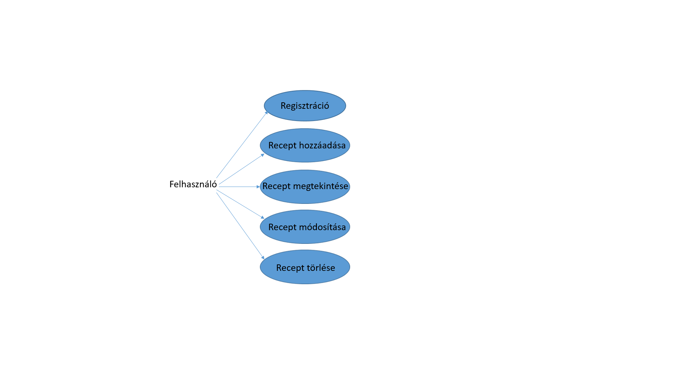
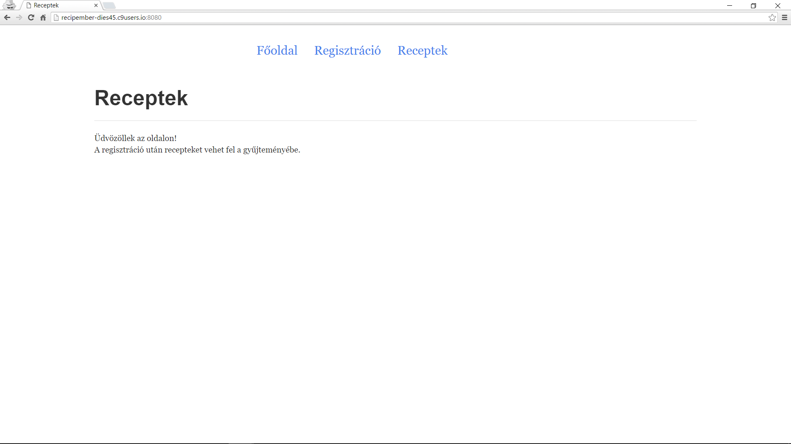
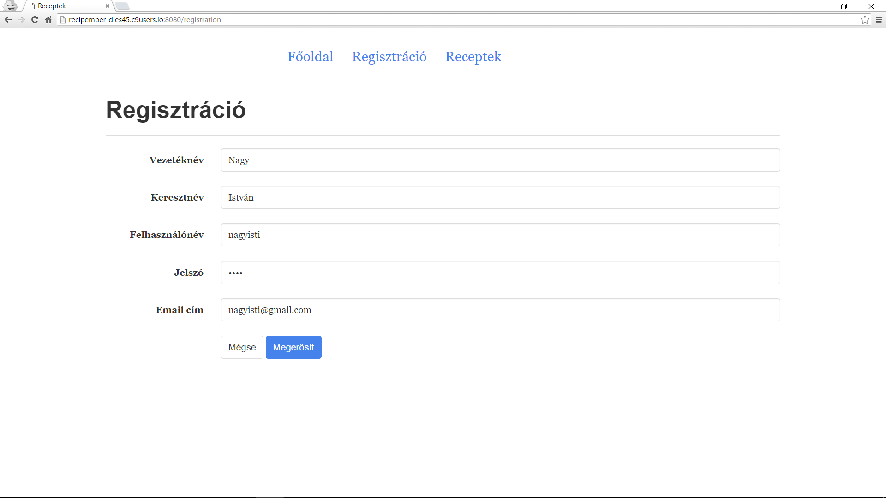
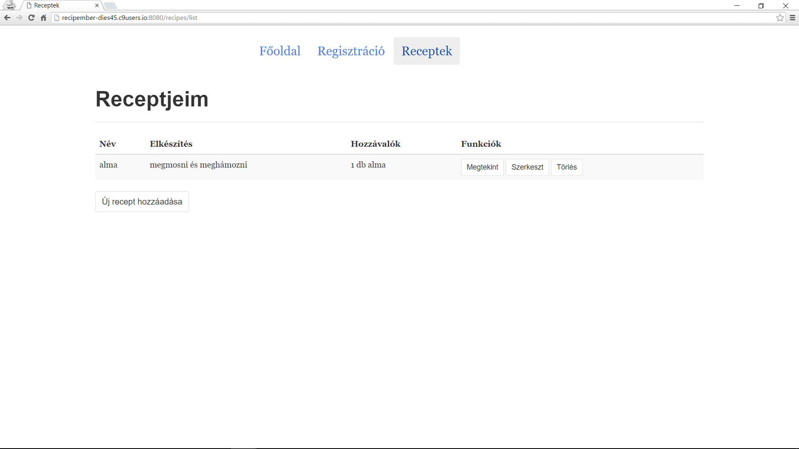
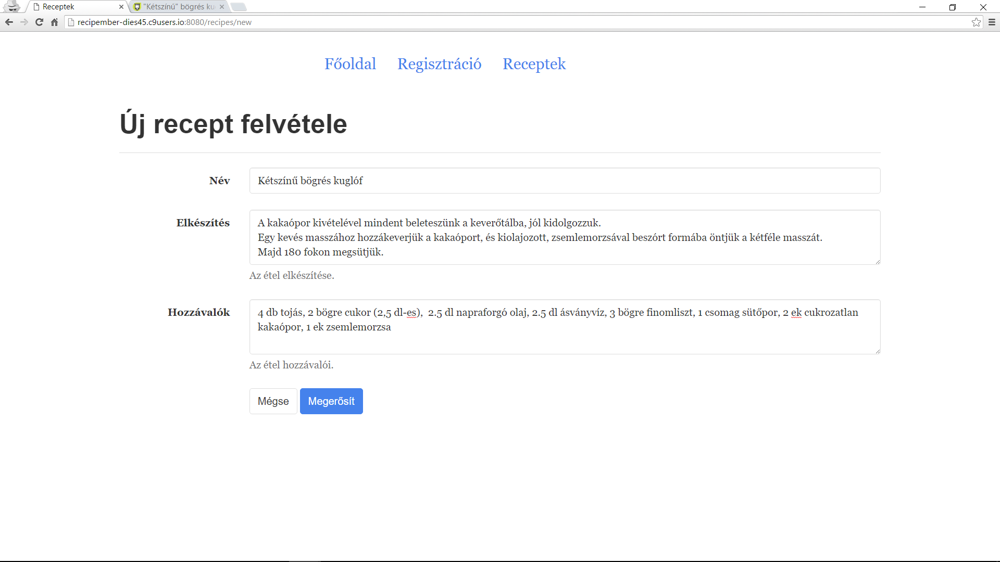
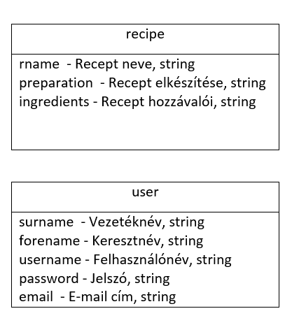

# Dokumentáció

## Követelményanalízis

Feladat: 
Egy webes vastagkliens, azaz egyoldalas alkalmazás készítése Ember.js segítségével az utolsó beadandó.
Feladatot illetően lehet a szerveroldali alkalmazásnak egy kliensoldali változata, de másik feladat is választható.
A feladatnak mininálisan tartalmaznia kell:

- legalább két modellt, egy-sok kapcsolatban
- legalább 1 űrlapot
- legalább 1 listázó oldalt
- legyen lehetőség új felvételére
- legyen lehetőség meglévő szerkesztésére
- legyen lehetőség meglévő törlésére
- REST API végpont kialakítása
- szerveroldali perzisztálás fájlba

Választott feladat: Receptek és hozzávalók

Funkcionális elvárások:
- A felhaszáló recepteket szeretne tároli, erre szolgál az új recept hozzáadása.
- A felvett recepteket meg kell jeleníteni, későbbi olvasásra.
- A recepteket meg lehessen tekinteni és lehessen módosítani.
- A recepteket lehessen törölni is.
- A főoldalon legyen rövid tájékoztató.

Nem funkcionális elvárások:
- Felhasználóbarát elrendezés
- Gyors működés

Használatieset-modell:

Szerepkörök:
- felhasználó: a főoldalhoz, a regisztrációhoz és a receptekhez fér hozzá, ezeket tudja módosítani és törölni

Használati eset diagram:

Folyamat menete: Főoldal->Regisztráció->Receptek->Új recept hozzáadása

##Tervezés

Architektúra terv:

Oldaltérkép:
- Főoldal
- Regisztráció
- Receptek felvétele
- Recept szerkesztése
- Recept megtekintése

Végpontok:
- / -Főoldal
- /registration -Regisztráció
- /recipes/list -Receptek
- /recipes/list/new -Új recept hozzáadása
- /recipes/list/:id -Recept megtekintése
- /recipes/list/edit/:id -Recept módosítása

Felhasználói felület:

Osztálymodell:

##Implementáció

Fejlesztői környezet:
- Cloud9 Web IDE
- Ember.js

Könyvtárstruktúrában lévő mappák funkciójának bemutatása:

- receptek/app/pods/index -főoldal
- receptek/app/pods/recipe -recipe adatmodell
- receptek/app/pods/user -user adatmodell
- receptek/app/pods/registration -regisztráció
- receptek/app/pods/recipes/* -receptek listázása, felvétele, megtekintése, módosítása

##Tesztelés

Teszt eredménye a [http://http://recipember-dies45.c9users.io/tests](http://recipember-dies45.c9users.io/tests) oldalon.

##Felhasználói dokumentáció

Rendszerkövetelmény:

- Internetkapcsolat
- 512MB RAM, 1GB HDD
- Grafikus felületű operációs rendszer
- Webböngésző
 
Futtatás:

Az alkalmazás futtatását megelőzően a program REST API részét elindítani.
A server.js-t kell futtatni.
Miután ez elindult futtathatjuk a kliensprogramunkat is a receptek mappából az ember serve paranccsal.
Ha sikeresen elindult minden, akkor a megjelenő címen megtekinthetjük a webes alkalmazásunkat.

Használat:

A felhasználó a főoldalon kezd, innen regisztrálhat a Regisztráció fülre kattintva.
A regisztráció után megjelenik a Receptek listaoldal, ahol recepteket lehet felvenni az új recept hozzáadása gombra kattintva.
Ekkor három szöveges részt kell kitölteni: a recept nevét, a recept elkészítését és a hozzávalóit.
A megerősít gombra kattintva a recept felvételre kerül a listába, amit ekkor megtekinthetünk a megtekint gombra kattintva, vagy módosíthatunk a módosít funkcióra kattintva, esetleg törölhetünk a töröl gombra kattintva.

